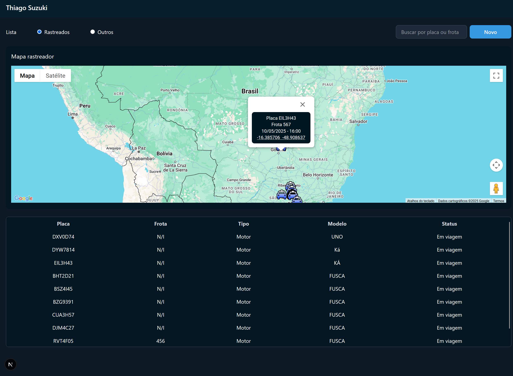

# CONTROL APP TRACKER
Aplicação de Rastreio e Consulta de Veículos com Google Maps e Tanstack Query

<h1 align="center">
  
</h1>


## 💻 Tecnologias Utilizadas nesse Projeto
<div style="display: inline_block">
  
  
  
  
  
  
</div>

<br>

## Especificações
- Node: 22.11.0
- Pacote de Gerenciamento de Dependências: NPM
- Framework: NextJS
- Deploy: Vercel
- Link Deploy: https://tracker-vehicles.vercel.app/

<br>

## Como Rodar a Aplicação
- Clone o projeto frontend
- Realize a instalação das dependências:
```bash
$ npm install
```
- Configure um arquivo .env com as variáveis de ambiente:
```bash
NEXT_PUBLIC_API_ROTA=
NEXT_PUBLIC_TOKEN=
NEXT_PUBLIC_GOOGLE_MAPS_API_KEY=
```
- Em seguida, rode o Projeto:
```bash
$ npm run dev
```